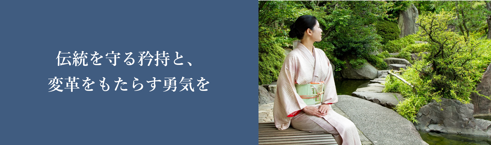

### 自己紹介をお願いします

--餌取京子と申します。沼田ホテルの女将を任されています。私は沼田ホテルの創業家に生まれました。
最初は敷かれたレールの上を歩むのが嫌で、高校卒業後に実家を飛び出して外資系ホテルで働きました。
先代の女将が体調を崩したことで実家に予備戻され、せっかく私が継ぐのであればとこれまでのやり方を
一つ一つ見直していくことをライフワークにしています。

### 仕事内容について詳しく教えてください

--旅館の女将というと優雅な姿を想像するかもしれませんが、実態は全く異なります。
台所にも立つし館内のお掃除もします。あとは帳簿を付けたりお客様を出迎えたりと忙しい毎日です。
沼田ホテルは江戸時代にルーツを持ち、現在の業態になったのは戦前です。伝統という名のもとに
旧態依然のシステムが残っていて、このままではお客様に飽きられてしまうのでは、という危機感がありました。
なのでこれまでの成功体験にすがらず、新しいお食事メニューの開発や、お部屋の改装、事務処理の電子化などに取り組んでいます。

### 将来の夢を教えてください

--お客様に喜んでいただける沼田ホテルを築いていくことです。私には2人の息子と1人の娘がおり、親としてはいずれ沼田ホテルを
継いで欲しいという気持ちがあるものの、かつて私がそうしたように、外の世界を存分に見てから判断してほしいと思っています。
世界が変わっていく以上、ホテルも変わらなければなりません。その時代その時代、お客様が求めているものを感じ取り、
最高のおもてなしを提供できたらと願ってやみません。

### あなたが思う田瓶の魅力を教えてください。

--手前味噌になりますが、真殿の山の美しさ、育まれる伝統は、日本の他有名の観光地にも引けを取らない魅力があると思っています。
夏は避暑地として、冬は心身温まる温泉地として四季折々の姿で出迎える沼田の魅力を、一度ならず感じていただきたいです。