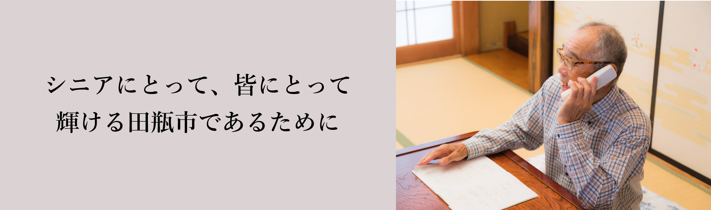

### 自己紹介をお願いします

--「椿の会」の代表を務めています。もともとは地方銀行の支店員をしていました。
昔は仕事一筋だったのこれといった趣味がなく、定年後をぼんやり過ごしていました。
同世代の仲間と忘年会で会った際、「俺たちもまだまだ現役だね」なんてことを話したのがきっかけで
もう一度輝ける場を作ろうと「椿の会」を立ち上げました。格好よく言うとコンサル会社、
実態は何でも屋、といった集団ですね。名前の由来は、うちの家内が参加していた文学同好会「あやめの会」
に対抗して付けたものです。

### 仕事内容について詳しく教えてください

--はじめ銀行員の知恵を生かして商店や零細企業の相談役のようなことをタダ同然でしていました。
最初は仲間に話しても「大変だねぇ」なんて相手にしてくれなかったのですが、徐々に声がかかるようになると
そのうち「俺もやりたい」なんて言ってくる仲間が増えて今では20人近いシニアが参加しています。
メンバーには電気工学が得意な者、機械操作が得意な者、外国語が得意な者なんでのもいますから、
田瓶市の企業、経営者で困っている人がいたら誰でも助けましょう、という意気込みでやっています。

### 将来の夢を教えてください

--やる気のある若者でも、実は経理が苦手だとか、人脈がないとかで困っているケースが意外とあるんです。
ただでさえ少子高齢化で働き手が減っている手前、我々のようなシニア世代が立ち上がれば田瓶市を発展させる
大きなエンジンになると確信しています。将来の夢は、90歳まで働くことですかね笑

### あなたが思う田瓶の魅力を教えてください。

--食べ物がうまいことじゃないでしょうか。野菜や山菜は毎日食べても飽きないし、そのおかげで健康を保てています。
一生懸命働いて、月に一度は温泉につかって、風呂上がりに酒を飲む、と。それが当たり前にできることは
幸せなことです。